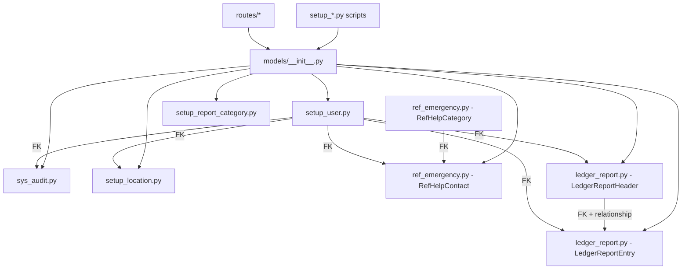

# Design Document: Backend DB Naming Refactor

## Overview

This document describes the technical design for renaming all database table names, Python model class names, and model filenames in the SafeMap-PH Flask/SQLAlchemy backend to follow a structured four-prefix naming convention.

The refactor is purely mechanical — no business logic changes, no schema column changes, no API contract changes. Every change is a rename: files, class names, `__tablename__` strings, foreign key reference strings, relationship target strings, import statements, and audit log `target_table` literals.

### Naming Convention

| Prefix    | Semantic Role               | Tables affected                                         |
| --------- | --------------------------- | ------------------------------------------------------- |
| `setup_`  | Master / configuration data | `setup_user`, `setup_report_category`, `setup_location` |
| `ref_`    | Reference / lookup tables   | `ref_help_category`, `ref_help_contact`                 |
| `ledger_` | Transactional / ledger data | `ledger_report_header`, `ledger_report_entry`           |
| `sys_`    | System-level infrastructure | `sys_audit_log` (unchanged)                             |

---

## Architecture

The backend is a Flask application with a SQLAlchemy ORM layer. The relevant layers are:

```
backend/
├── models/          ← SQLAlchemy model definitions (one or two classes per file)
│   └── __init__.py  ← Re-exports all model classes; the single import surface for routes
├── routes/          ← Flask blueprints; import models exclusively via models/__init__.py
├── set_up_*.py      ← Seed/init scripts at the backend root
└── app.py           ← Application factory
```

Because all routes import from `models` (the package), updating `models/__init__.py` is the single choke-point that makes new class names available to every route file. The refactor therefore proceeds in this order:

1. Rename and update model files (source of truth for table names and class names)
2. Update `models/__init__.py` (propagates new names to all consumers)
3. Update route files (swap old import aliases for new ones; update `target_table` literals)
4. Rename and update setup scripts

This ordering ensures that at no point does a partially-updated file reference a name that does not yet exist.

### Dependency Graph



---

## Components and Interfaces

### Model Files

Each model file rename is a one-to-one mapping:

| Old file                        | New file                          |
| ------------------------------- | --------------------------------- |
| `models/sys_user.py`            | `models/setup_user.py`            |
| `models/sys_report_category.py` | `models/setup_report_category.py` |
| `models/sys_location.py`        | `models/setup_location.py`        |
| `models/sys_emergency.py`       | `models/ref_emergency.py`         |
| `models/trans_report.py`        | `models/ledger_report.py`         |
| `models/sys_audit.py`           | `models/sys_audit.py` (unchanged) |

### Class Renames

| Old class           | New class             | File                       |
| ------------------- | --------------------- | -------------------------- |
| `SysUser`           | `SetupUser`           | `setup_user.py`            |
| `SysReportCategory` | `SetupReportCategory` | `setup_report_category.py` |
| `SysLocation`       | `SetupLocation`       | `setup_location.py`        |
| `SysHelpCategory`   | `RefHelpCategory`     | `ref_emergency.py`         |
| `SysHelpContact`    | `RefHelpContact`      | `ref_emergency.py`         |
| `TransReportHeader` | `LedgerReportHeader`  | `ledger_report.py`         |
| `TransReportLedger` | `LedgerReportEntry`   | `ledger_report.py`         |
| `SysAuditLog`       | `SysAuditLog`         | `sys_audit.py` (unchanged) |

### `__tablename__` Changes

| Old value             | New value                   |
| --------------------- | --------------------------- |
| `sys_user`            | `setup_user`                |
| `sys_report_category` | `setup_report_category`     |
| `sys_location`        | `setup_location`            |
| `sys_help_category`   | `ref_help_category`         |
| `sys_help_contact`    | `ref_help_contact`          |
| `trans_report_header` | `ledger_report_header`      |
| `trans_report_ledger` | `ledger_report_entry`       |
| `sys_audit_log`       | `sys_audit_log` (unchanged) |

### Foreign Key Reference Updates

All `db.ForeignKey(...)` string arguments that reference old table names must be updated:

| Location                                  | Column             | Old FK string              | New FK string               |
| ----------------------------------------- | ------------------ | -------------------------- | --------------------------- |
| `sys_audit.py` → `SysAuditLog`            | `actor_id`         | `'sys_user.id'`            | `'setup_user.id'`           |
| `ref_emergency.py` → `RefHelpContact`     | `category_id`      | `'sys_help_category.id'`   | `'ref_help_category.id'`    |
| `ref_emergency.py` → `RefHelpContact`     | `created_by`       | `'sys_user.id'`            | `'setup_user.id'`           |
| `setup_location.py` → `SetupLocation`     | `verified_by`      | `'sys_user.id'`            | `'setup_user.id'`           |
| `ledger_report.py` → `LedgerReportHeader` | `created_by`       | `'sys_user.id'`            | `'setup_user.id'`           |
| `ledger_report.py` → `LedgerReportEntry`  | `report_header_id` | `'trans_report_header.id'` | `'ledger_report_header.id'` |
| `ledger_report.py` → `LedgerReportEntry`  | `actor_id`         | `'sys_user.id'`            | `'setup_user.id'`           |

### Relationship String Updates

SQLAlchemy relationships that reference model class names by string must be updated:

| File               | Class                | Attribute        | Old target string     | New target string      |
| ------------------ | -------------------- | ---------------- | --------------------- | ---------------------- |
| `setup_user.py`    | `SetupUser`          | `reports`        | `'TransReportHeader'` | `'LedgerReportHeader'` |
| `setup_user.py`    | `SetupUser`          | `actions`        | `'TransReportLedger'` | `'LedgerReportEntry'`  |
| `ref_emergency.py` | `RefHelpCategory`    | `contacts`       | `'SysHelpContact'`    | `'RefHelpContact'`     |
| `ledger_report.py` | `LedgerReportHeader` | `ledger_entries` | `'TransReportLedger'` | `'LedgerReportEntry'`  |

### Route File Import Updates

Each route file imports model classes from `models`. The import aliases (e.g., `as User`) are preserved so that internal route logic requires no further changes.

| Route file            | Old import                                                                                                | New import                                                                                                   |
| --------------------- | --------------------------------------------------------------------------------------------------------- | ------------------------------------------------------------------------------------------------------------ |
| `routes/auth.py`      | `SysUser as User`                                                                                         | `SetupUser as User`                                                                                          |
| `routes/users.py`     | `SysUser as User`, `TransReportHeader`                                                                    | `SetupUser as User`, `LedgerReportHeader`                                                                    |
| `routes/reports.py`   | `TransReportHeader as Report`, `SysReportCategory as ReportCategory`, `TransReportLedger as ReportLedger` | `LedgerReportHeader as Report`, `SetupReportCategory as ReportCategory`, `LedgerReportEntry as ReportLedger` |
| `routes/locations.py` | `SysLocation as Location`                                                                                 | `SetupLocation as Location`                                                                                  |
| `routes/help.py`      | `SysHelpCategory as HelpCategory`, `SysHelpContact as HelpContact`                                        | `RefHelpCategory as HelpCategory`, `RefHelpContact as HelpContact`                                           |

### `target_table` Audit Log String Updates

`SysAuditLog.log(target_table=...)` calls pass the affected table name as a plain string. These must be updated in route files:

| Route file            | Old string              | New string               |
| --------------------- | ----------------------- | ------------------------ |
| `routes/auth.py`      | `'sys_user'`            | `'setup_user'`           |
| `routes/users.py`     | `'sys_user'`            | `'setup_user'`           |
| `routes/reports.py`   | `'trans_report_header'` | `'ledger_report_header'` |
| `routes/locations.py` | `'sys_location'`        | `'setup_location'`       |
| `routes/help.py`      | `'sys_help_contact'`    | `'ref_help_contact'`     |

### Setup Script Renames and Internal Updates

| Old filename                   | New filename                  |
| ------------------------------ | ----------------------------- |
| `set_up_database.py`           | `setup_database.py`           |
| `set_up_emergency_contacts.py` | `setup_emergency_contacts.py` |
| `set_up_risk_status.py`        | `setup_risk_status.py`        |

Internal class references within each script:

| Script                        | Old class(es)                       | New class(es)                       |
| ----------------------------- | ----------------------------------- | ----------------------------------- |
| `setup_database.py`           | `SysUser`                           | `SetupUser`                         |
| `setup_emergency_contacts.py` | `SysHelpCategory`, `SysHelpContact` | `RefHelpCategory`, `RefHelpContact` |
| `setup_risk_status.py`        | `SysReportCategory`                 | `SetupReportCategory`               |

`setup_database.py` also prints next-step instructions that reference the old script names; these strings must be updated to `setup_emergency_contacts.py` and `setup_risk_status.py`.

### `models/__init__.py` Interface

After the refactor, `models/__init__.py` must export exactly:

```python
from models.setup_user import SetupUser
from models.ledger_report import LedgerReportHeader, LedgerReportEntry
from models.setup_location import SetupLocation
from models.ref_emergency import RefHelpCategory, RefHelpContact
from models.setup_report_category import SetupReportCategory
from models.sys_audit import SysAuditLog

__all__ = [
    'db',
    'SetupUser',
    'LedgerReportHeader',
    'LedgerReportEntry',
    'SetupLocation',
    'RefHelpCategory',
    'RefHelpContact',
    'SetupReportCategory',
    'SysAuditLog',
]
```

---

## Data Models

No column definitions, data types, constraints, or indexes change. The only schema-level change is the table name itself (the `__tablename__` attribute). A database migration is required to rename the tables in the live database.

### Migration Strategy

Since this is a rename-only migration, Alembic's `op.rename_table` is the appropriate primitive. Each table rename is independent and can be applied in any order because foreign key constraints in SQLite (the likely dev database) are not enforced by default, and in PostgreSQL the FK constraints reference table names — they must be dropped and re-added around the rename.

Recommended migration order (avoids FK constraint conflicts on PostgreSQL):

1. Rename `sys_user` → `setup_user` (referenced by many FKs; rename first so subsequent steps can reference the new name)
2. Rename `sys_report_category` → `setup_report_category`
3. Rename `sys_location` → `setup_location`
4. Rename `sys_help_category` → `ref_help_category`
5. Rename `sys_help_contact` → `ref_help_contact`
6. Rename `trans_report_header` → `ledger_report_header`
7. Rename `trans_report_ledger` → `ledger_report_entry`
8. `sys_audit_log` — no change

For each rename on PostgreSQL, the migration must also update any FK constraints that reference the old table name.

---

## Correctness Properties

_A property is a characteristic or behavior that should hold true across all valid executions of a system — essentially, a formal statement about what the system should do. Properties serve as the bridge between human-readable specifications and machine-verifiable correctness guarantees._

### Property 1: No old class names remain in any backend Python source file

_For any_ Python source file under `backend/` (excluding comments and docstrings), the file's text must not contain any of the strings `SysUser`, `SysReportCategory`, `SysLocation`, `SysHelpCategory`, `SysHelpContact`, `TransReportHeader`, or `TransReportLedger`.

**Validates: Requirements 1.2, 2.2, 3.2, 4.2, 5.1, 6.2, 7.1, 10.1–10.6, 12.1**

---

### Property 2: No old `__tablename__` values exist in any model class

_For any_ SQLAlchemy model class importable from `backend/models`, its `__tablename__` attribute must not be one of `sys_user`, `sys_report_category`, `sys_location`, `sys_help_category`, `sys_help_contact`, `trans_report_header`, or `trans_report_ledger`.

**Validates: Requirements 1.3, 2.3, 3.3, 4.3, 5.2, 6.3, 7.2, 12.2**

---

### Property 3: No old foreign key reference strings remain in any model file

_For any_ Python source file under `backend/models/`, the file's text must not contain any of the FK strings `'sys_user.id'`, `'sys_help_category.id'`, `'trans_report_header.id'`, or `'sys_location.id'` as a `db.ForeignKey(...)` argument.

**Validates: Requirements 1.4, 3.4, 5.3, 5.4, 6.4, 7.3, 7.4, 8.4, 12.3**

---

### Property 4: No old `target_table` strings remain in any route file

_For any_ Python source file under `backend/routes/`, the file's text must not contain any of the strings `'sys_user'`, `'sys_location'`, `'sys_help_contact'`, or `'trans_report_header'` as a `target_table=` argument in a `SysAuditLog.log(...)` call.

**Validates: Requirements 1.5, 3.5, 5.5, 6.6, 12.4**

---

## Error Handling

This refactor introduces no new runtime error paths. However, the following failure modes must be guarded against during execution:

**Stale string references** — Any hardcoded string that names a table (FK strings, `target_table` literals, relationship target strings) that is missed during the refactor will cause a SQLAlchemy `NoReferencedTableError` or `NoInspectionAvailable` at application startup or query time. The correctness properties above are designed to catch these before deployment.

**Partial migration** — If the database migration runs but the code is not yet deployed (or vice versa), the application will fail to start because SQLAlchemy's mapper will attempt to reflect or validate table names. The migration and code deployment must be atomic from the application's perspective (deploy code, then run migration, or use a maintenance window).

**Missing `__init__.py` export** — If a new class name is added to a model file but not exported from `models/__init__.py`, any route that imports it will raise an `ImportError` at startup. The `__all__` check in the test suite catches this.

**Setup script references** — If the old setup scripts (`set_up_*.py`) are invoked after the refactor, they will fail with `ImportError` because the old class names no longer exist. The scripts must be renamed and updated before any re-seeding is attempted.

---

## Testing Strategy

### Dual Testing Approach

Both unit tests and property-based tests are required. Unit tests verify specific examples and integration points; property-based tests verify universal invariants across the entire file set.

### Unit Tests (Example-Based)

These tests verify specific, concrete post-conditions of the refactor. Each test corresponds to a single acceptance criterion.

**File existence checks:**

- `setup_user.py` exists; `sys_user.py` does not
- `setup_report_category.py` exists; `sys_report_category.py` does not
- `setup_location.py` exists; `sys_location.py` does not
- `ref_emergency.py` exists; `sys_emergency.py` does not
- `ledger_report.py` exists; `trans_report.py` does not
- `sys_audit.py` still exists (unchanged)
- `setup_database.py` exists; `set_up_database.py` does not
- `setup_emergency_contacts.py` exists; `set_up_emergency_contacts.py` does not
- `setup_risk_status.py` exists; `set_up_risk_status.py` does not

**`__tablename__` checks (import each class and assert):**

- `SetupUser.__tablename__ == 'setup_user'`
- `SetupReportCategory.__tablename__ == 'setup_report_category'`
- `SetupLocation.__tablename__ == 'setup_location'`
- `RefHelpCategory.__tablename__ == 'ref_help_category'`
- `RefHelpContact.__tablename__ == 'ref_help_contact'`
- `LedgerReportHeader.__tablename__ == 'ledger_report_header'`
- `LedgerReportEntry.__tablename__ == 'ledger_report_entry'`
- `SysAuditLog.__tablename__ == 'sys_audit_log'`

**`models/__init__.py` exports:**

- All of `SetupUser`, `SetupReportCategory`, `SetupLocation`, `RefHelpCategory`, `RefHelpContact`, `LedgerReportHeader`, `LedgerReportEntry`, `SysAuditLog` are importable from `models`
- `__all__` contains exactly these names (plus `db`)

**Relationship and method checks:**

- `RefHelpCategory.contacts` relationship targets `RefHelpContact`
- `LedgerReportHeader.ledger_entries` relationship targets `LedgerReportEntry`
- `SetupUser.reports` relationship targets `LedgerReportHeader`
- `SetupUser.actions` relationship targets `LedgerReportEntry`
- `LedgerReportHeader.add_ledger_entry(...)` returns an instance of `LedgerReportEntry`
- `SetupReportCategory.get_report_count()` executes without error (queries `ledger_report_header`)

**Setup script checks:**

- `setup_database.py` source text contains `'setup_emergency_contacts.py'` and `'setup_risk_status.py'` in its print statements
- `setup_emergency_contacts.py` imports `RefHelpCategory` and `RefHelpContact`
- `setup_risk_status.py` imports `SetupReportCategory`
- `setup_database.py` imports `SetupUser`

### Property-Based Tests

Property-based tests use a library such as `hypothesis` (Python). Each test runs a minimum of 100 iterations.

**Property 1 test — No old class names in source files**

```
# Feature: backend-db-naming-refactor, Property 1: No old class names remain in any backend Python source file
@given(
    filepath=st.sampled_from(list(Path('backend').rglob('*.py')))
)
@settings(max_examples=len(list(Path('backend').rglob('*.py'))))
def test_no_old_class_names(filepath):
    source = filepath.read_text()
    # Strip comments and docstrings before scanning
    for old_name in ['SysUser', 'SysReportCategory', 'SysLocation',
                     'SysHelpCategory', 'SysHelpContact',
                     'TransReportHeader', 'TransReportLedger']:
        assert old_name not in strip_comments(source), \
            f"{old_name} found in {filepath}"
```

**Property 2 test — No old `__tablename__` values**

```
# Feature: backend-db-naming-refactor, Property 2: No old __tablename__ values exist in any model class
@given(
    model_class=st.sampled_from(all_model_classes())
)
def test_no_old_tablenames(model_class):
    old_names = {'sys_user', 'sys_report_category', 'sys_location',
                 'sys_help_category', 'sys_help_contact',
                 'trans_report_header', 'trans_report_ledger'}
    assert model_class.__tablename__ not in old_names
```

**Property 3 test — No old FK strings in model files**

```
# Feature: backend-db-naming-refactor, Property 3: No old foreign key reference strings remain in any model file
@given(
    filepath=st.sampled_from(list(Path('backend/models').glob('*.py')))
)
@settings(max_examples=len(list(Path('backend/models').glob('*.py'))))
def test_no_old_fk_strings(filepath):
    source = filepath.read_text()
    for old_fk in ["'sys_user.id'", "'sys_help_category.id'",
                   "'trans_report_header.id'", "'sys_location.id'"]:
        assert old_fk not in source, f"{old_fk} found in {filepath}"
```

**Property 4 test — No old `target_table` strings in route files**

```
# Feature: backend-db-naming-refactor, Property 4: No old target_table strings remain in any route file
@given(
    filepath=st.sampled_from(list(Path('backend/routes').glob('*.py')))
)
@settings(max_examples=len(list(Path('backend/routes').glob('*.py'))))
def test_no_old_target_table_strings(filepath):
    source = filepath.read_text()
    for old_table in ["'sys_user'", "'sys_location'",
                      "'sys_help_contact'", "'trans_report_header'"]:
        assert old_table not in source, f"{old_table} found in {filepath}"
```

### Test Configuration

- Property-based tests use `hypothesis` with `@settings(max_examples=100)` minimum
- Each property test is tagged with a comment in the format: `# Feature: backend-db-naming-refactor, Property N: <property text>`
- Unit tests use `pytest` with no external dependencies beyond the Flask app context
- Tests that check `__tablename__` or relationships require the Flask app context (`app.app_context()`) to be active so SQLAlchemy mappers are configured
