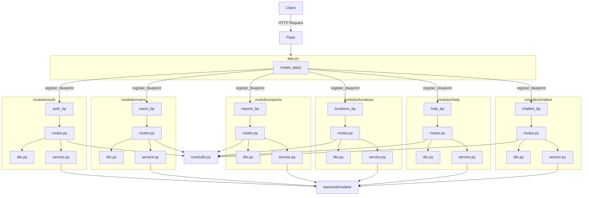
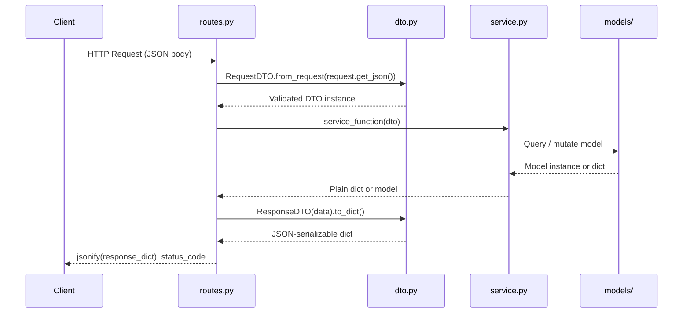

# Design Document: Backend Modular Architecture

## Overview

This refactor restructures the SafeMap-PH Flask backend from a flat `routes/` layout into a feature-module architecture. Each of the six domains (auth, users, reports, locations, help, chatbot) becomes a self-contained module under `backend/modules/`, with its own Blueprint, service layer, and DTOs. Shared utilities move from `backend/utils/` to `backend/core/utils.py`. All existing API contracts are preserved.

The primary goals are:
- Separation of concerns: routes handle HTTP, services handle business logic, DTOs define data shapes
- Testability: service functions can be unit-tested without Flask context
- Discoverability: all domain logic lives in one place per domain

---

## Architecture

### High-Level Component Diagram



### Request Data Flow



---

## Components and Interfaces

### Directory Structure

```
backend/
├── modules/
│   ├── auth/
│   │   ├── __init__.py       # exports auth_bp
│   │   ├── routes.py         # auth_bp, route handlers
│   │   ├── service.py        # login_user, register_user, ...
│   │   └── dto.py            # LoginRequestDTO, RegisterRequestDTO, TokenResponseDTO
│   ├── users/
│   │   ├── __init__.py       # exports users_bp
│   │   ├── routes.py
│   │   ├── service.py
│   │   └── dto.py            # CreateUserDTO, UpdateUserDTO, UserResponseDTO
│   ├── reports/
│   │   ├── __init__.py       # exports reports_bp
│   │   ├── routes.py
│   │   ├── service.py
│   │   └── dto.py            # SubmitReportDTO, ReportResponseDTO, ReportActionDTO
│   ├── locations/
│   │   ├── __init__.py       # exports locations_bp
│   │   ├── routes.py
│   │   ├── service.py
│   │   └── dto.py            # CreateLocationDTO, UpdateLocationDTO, LocationResponseDTO
│   ├── help/
│   │   ├── __init__.py       # exports help_bp
│   │   ├── routes.py
│   │   ├── service.py
│   │   └── dto.py            # CreateContactDTO, UpdateContactDTO, ContactResponseDTO
│   └── chatbot/
│       ├── __init__.py       # exports chatbot_bp
│       ├── routes.py
│       ├── service.py
│       └── dto.py            # ChatQueryDTO, ChatResponseDTO
├── core/
│   ├── __init__.py
│   └── utils.py              # JWT, require_auth, get_current_user, validate_json, paginate_query
├── models/                   # unchanged
├── app.py                    # registers all 6 blueprints
├── config.py
└── extensions.py
```

### `app.py` Blueprint Registration Pattern

```python
def create_app(config_class=None):
    app = Flask(__name__)
    # ... init extensions ...

    from modules.auth import auth_bp
    from modules.users import users_bp
    from modules.reports import reports_bp
    from modules.locations import locations_bp
    from modules.help import help_bp
    from modules.chatbot import chatbot_bp

    for bp in [auth_bp, users_bp, reports_bp, locations_bp, help_bp, chatbot_bp]:
        app.register_blueprint(bp, url_prefix='/api')

    return app
```

If any import fails, Python raises `ImportError` at startup — no silent skipping.

### Module `__init__.py` Pattern

Each module's `__init__.py` simply re-exports its Blueprint:

```python
# modules/auth/__init__.py
from modules.auth.routes import auth_bp
__all__ = ['auth_bp']
```

### Route Handler Pattern

Route handlers are thin: parse → call service → serialize → respond.

```python
@auth_bp.route('/auth/login', methods=['POST'])
def login():
    data = request.get_json() or {}
    dto = LoginRequestDTO.from_request(data)          # parse + validate
    result = login_user(dto)                           # delegate to service
    return jsonify(TokenResponseDTO(**result).to_dict()), 200
```

### Service Function Pattern

Services are plain functions — no Flask imports, no `request`, no `jsonify`.

```python
# modules/auth/service.py
def login_user(dto: LoginRequestDTO) -> dict:
    user = SetupUser.query.filter(
        (SetupUser.username == dto.username) | (SetupUser.email == dto.username)
    ).first()
    if not user or not user.check_password(dto.password):
        raise AuthenticationError("Invalid username or password")
    access_token = create_token(user.id, 'access')
    refresh_token = create_token(user.id, 'refresh')
    SysAuditLog.log(...)
    db.session.commit()
    return {'user': user.to_dict(), 'access_token': access_token, ...}
```

---

## Data Models

### DTO Definitions Per Module

All DTOs are Python `dataclass` instances. Request DTOs implement `from_request(cls, data: dict)` and raise `ValueError` on missing required fields. Response DTOs implement `to_dict(self) -> dict`.

#### `modules/auth/dto.py`

```python
@dataclass
class LoginRequestDTO:
    username: str
    password: str

    @classmethod
    def from_request(cls, data: dict) -> 'LoginRequestDTO':
        if not data.get('username'):
            raise ValueError("username is required")
        if not data.get('password'):
            raise ValueError("password is required")
        return cls(username=data['username'], password=data['password'])

@dataclass
class RegisterRequestDTO:
    username: str
    email: str
    password: str
    full_name: Optional[str] = None
    phone: Optional[str] = None
    role: str = 'user'

    @classmethod
    def from_request(cls, data: dict) -> 'RegisterRequestDTO':
        for field in ['username', 'email', 'password']:
            if not data.get(field):
                raise ValueError(f"{field} is required")
        return cls(
            username=data['username'], email=data['email'],
            password=data['password'], full_name=data.get('full_name'),
            phone=data.get('phone'), role=data.get('role', 'user')
        )

@dataclass
class TokenResponseDTO:
    message: str
    user: dict
    access_token: str
    refresh_token: str
    token_type: str = 'Bearer'

    def to_dict(self) -> dict:
        return asdict(self)
```

#### `modules/users/dto.py`

```python
@dataclass
class CreateUserDTO:
    username: str
    email: str
    password: str
    full_name: Optional[str] = None
    phone: Optional[str] = None
    role: str = 'user'

    @classmethod
    def from_request(cls, data: dict) -> 'CreateUserDTO': ...

@dataclass
class UpdateUserDTO:
    full_name: Optional[str] = None
    phone: Optional[str] = None
    profile_image: Optional[str] = None
    role: Optional[str] = None
    is_active: Optional[bool] = None
    is_verified: Optional[bool] = None
    current_password: Optional[str] = None
    new_password: Optional[str] = None

    @classmethod
    def from_request(cls, data: dict) -> 'UpdateUserDTO': ...

@dataclass
class UserResponseDTO:
    # mirrors SetupUser.to_dict() fields
    def to_dict(self) -> dict: ...
```

#### `modules/reports/dto.py`

```python
@dataclass
class SubmitReportDTO:
    title: str
    description: str
    latitude: float
    longitude: float
    category: str
    severity: str = 'medium'
    barangay: Optional[str] = None
    address: Optional[str] = None
    image_url: Optional[str] = None

    @classmethod
    def from_request(cls, data: dict) -> 'SubmitReportDTO':
        for field in ['title', 'description', 'latitude', 'longitude', 'category']:
            if not data.get(field) and data.get(field) != 0:
                raise ValueError(f"{field} is required")
        return cls(
            title=data['title'], description=data['description'],
            latitude=float(data['latitude']), longitude=float(data['longitude']),
            category=data['category'], severity=data.get('severity', 'medium'),
            barangay=data.get('barangay'), address=data.get('address'),
            image_url=data.get('image_url')
        )

@dataclass
class ReportResponseDTO:
    def to_dict(self) -> dict: ...

@dataclass
class ReportActionDTO:
    notes: Optional[str] = None
    reason: Optional[str] = None
    case_number: Optional[str] = None

    @classmethod
    def from_request(cls, data: dict) -> 'ReportActionDTO': ...
```

#### `modules/locations/dto.py`

```python
@dataclass
class CreateLocationDTO:
    name: str
    latitude: float
    longitude: float
    location_type: str = 'general'
    address: Optional[str] = None
    city: Optional[str] = None
    barangay: Optional[str] = None
    description: Optional[str] = None
    facilities: Optional[str] = None
    operating_hours: Optional[str] = None
    contact_info: Optional[str] = None
    is_verified: bool = False

    @classmethod
    def from_request(cls, data: dict) -> 'CreateLocationDTO': ...

@dataclass
class UpdateLocationDTO:
    # all fields optional
    @classmethod
    def from_request(cls, data: dict) -> 'UpdateLocationDTO': ...

@dataclass
class LocationResponseDTO:
    def to_dict(self) -> dict: ...
```

#### `modules/help/dto.py`

```python
@dataclass
class CreateContactDTO:
    name: str
    category: str
    description: Optional[str] = None
    phone: Optional[str] = None
    phone_alt: Optional[str] = None
    email: Optional[str] = None
    website: Optional[str] = None
    address: Optional[str] = None
    latitude: Optional[float] = None
    longitude: Optional[float] = None
    operating_hours: Optional[str] = None
    is_24_7: bool = False

    @classmethod
    def from_request(cls, data: dict) -> 'CreateContactDTO': ...

@dataclass
class UpdateContactDTO:
    # all fields optional
    @classmethod
    def from_request(cls, data: dict) -> 'UpdateContactDTO': ...

@dataclass
class ContactResponseDTO:
    def to_dict(self) -> dict: ...
```

#### `modules/chatbot/dto.py`

```python
@dataclass
class ChatQueryDTO:
    message: str
    context: dict = field(default_factory=dict)

    @classmethod
    def from_request(cls, data: dict) -> 'ChatQueryDTO':
        if not data.get('message'):
            raise ValueError("message is required")
        return cls(message=data['message'], context=data.get('context', {}))

@dataclass
class ChatResponseDTO:
    response: dict
    timestamp: Optional[str] = None

    def to_dict(self) -> dict:
        return {'response': self.response, 'timestamp': self.timestamp}
```

### `core/utils.py` Interface

All functions move verbatim from `backend/utils/__init__.py`. Signatures are unchanged:

```python
def create_token(user_id: int, token_type: str = 'access') -> str: ...
def decode_token(token: str) -> Optional[dict]: ...
def require_auth(f) -> Callable: ...          # decorator
def get_current_user() -> Optional[SetupUser]: ...
def validate_json(**kwargs) -> Callable: ...  # decorator factory
def paginate_query(query, page: int = 1, per_page: int = 20): ...
def success_response(data=None, message=None, status_code=200): ...
def error_response(message: str, status_code=400, errors=None): ...
```

All module imports change from `from utils import ...` to `from core.utils import ...`.

`backend/utils/__init__.py` is emptied (kept as a stub to avoid breaking any external tooling that may scan the directory).

---

## Correctness Properties

*A property is a characteristic or behavior that should hold true across all valid executions of a system — essentially, a formal statement about what the system should do. Properties serve as the bridge between human-readable specifications and machine-verifiable correctness guarantees.*

### Property 1: DTO round-trip fidelity

*For any* valid request dict that satisfies a Request DTO's required fields, calling `from_request(data)` should produce a DTO whose field values match the input dict, and calling `to_dict()` on a Response DTO constructed from that data should return a JSON-serializable dict (i.e., `json.dumps()` succeeds without error).

**Validates: Requirements 5.2, 5.4**

### Property 2: Missing required field raises

*For any* Request DTO and *for any* required field in that DTO, if that field is absent or empty in the input dict, `from_request()` shall raise `ValueError` or `KeyError` — never silently produce a DTO with a `None` value for a required field.

**Validates: Requirements 5.3**

### Property 3: Service functions are Flask-context-free and return plain values

*For any* service function called with valid DTO or plain-value arguments outside a Flask application context, the function shall complete without raising a `RuntimeError` (no implicit `current_app` access) and shall return a value whose type is `dict`, `list`, or a SQLAlchemy model instance — never a Flask `Response` object.

**Validates: Requirements 4.2, 4.3**

### Property 4: Service raises exception on business rule violation

*For any* service function called with inputs that violate a business rule (e.g., duplicate username, invalid report category, wrong password), the function shall raise a Python exception — never return a Flask `Response` object or call `jsonify`.

**Validates: Requirements 4.4**

### Property 5: HTTP status code preservation for valid requests

*For any* HTTP request that returned a 2xx status code against the original flat-routes backend, the same request sent to the refactored modular backend shall return the same HTTP status code.

**Validates: Requirements 7.4**

### Property 6: Auth and authorization rule preservation

*For any* protected endpoint and *for any* combination of (missing token, invalid token, expired token, valid token for inactive user, valid token for active user with insufficient role), the HTTP status code returned by the refactored backend shall be identical to the status code returned by the original backend.

**Validates: Requirements 6.4, 7.5**

### Property 7: Response JSON shape preservation

*For any* request (valid or invalid) sent to any endpoint, the set of top-level JSON keys in the response body from the refactored backend shall be identical to the set of top-level JSON keys from the original backend for the same request.

**Validates: Requirements 7.2, 7.3**

---

## Error Handling

### Domain Exceptions

Services raise typed exceptions instead of returning HTTP responses. Route handlers catch these and map them to status codes:

| Exception | HTTP Status | Example |
|---|---|---|
| `ValueError` (from DTO) | 400 | Missing required field |
| `AuthenticationError` | 401 | Invalid credentials |
| `AuthorizationError` | 403 | Insufficient role |
| `NotFoundError` | 404 | Resource not found |
| `ConflictError` | 409 | Duplicate username/email |

Route handlers use a consistent catch pattern:

```python
@auth_bp.route('/auth/login', methods=['POST'])
def login():
    try:
        dto = LoginRequestDTO.from_request(request.get_json() or {})
        result = login_user(dto)
        return jsonify(TokenResponseDTO(**result).to_dict()), 200
    except ValueError as e:
        return jsonify({'error': str(e)}), 400
    except AuthenticationError as e:
        return jsonify({'error': str(e)}), 401
```

### Global Error Handlers

`app.py` retains the existing 404 and 500 handlers. A new handler catches unhandled `Exception` and returns a generic 500 to avoid leaking stack traces.

### Validation Errors

`validate_json` from `core/utils.py` continues to guard endpoints that require a JSON body. DTOs provide field-level validation on top of this.

---

## Testing Strategy

### Dual Testing Approach

Both unit tests and property-based tests are required. They are complementary:
- Unit tests verify specific examples, integration points, and error conditions
- Property tests verify universal correctness across randomized inputs

### Unit Tests

Focus areas:
- Each service function called with a valid DTO returns the expected dict shape
- Each service function called with an invalid state raises the correct exception
- Route handlers return correct status codes for success and error cases
- `core/utils.py` functions behave identically to the originals in `utils/__init__.py`
- Blueprint registration in `create_app()` succeeds without errors

### Property-Based Testing

Library: **Hypothesis** (Python)

Each property test runs a minimum of 100 iterations. Tests are tagged with a comment referencing the design property.

```python
# Feature: backend-modular-architecture, Property 1: DTO round-trip fidelity
@given(st.fixed_dictionaries({
    'username': st.text(min_size=1),
    'password': st.text(min_size=1)
}))
def test_login_dto_roundtrip(data):
    dto = LoginRequestDTO.from_request(data)
    assert dto.username == data['username']
    assert dto.password == data['password']
```

**Property test mapping:**

| Design Property | Test Description |
|---|---|
| Property 1 | DTO round-trip: `from_request` preserves input fields; `to_dict()` is JSON-serializable |
| Property 2 | Missing required field always raises `ValueError`/`KeyError` |
| Property 3 | Service functions callable without Flask context; never return `Response` |
| Property 4 | Service functions raise exceptions (not `Response`) on business rule violations |
| Property 5 | HTTP status codes match original handlers for all valid inputs |
| Property 6 | Auth/authz status codes identical to original for all token states |
| Property 7 | Response JSON top-level keys identical to original for all request outcomes |

Each correctness property is implemented by a single property-based test. Unit tests cover specific examples and edge cases that complement the property tests.
